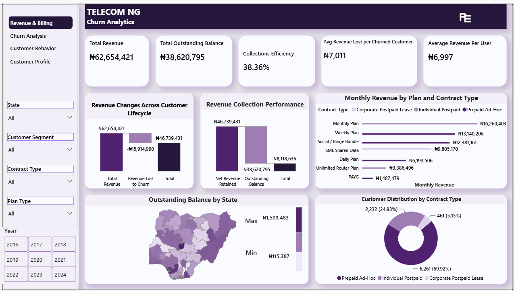
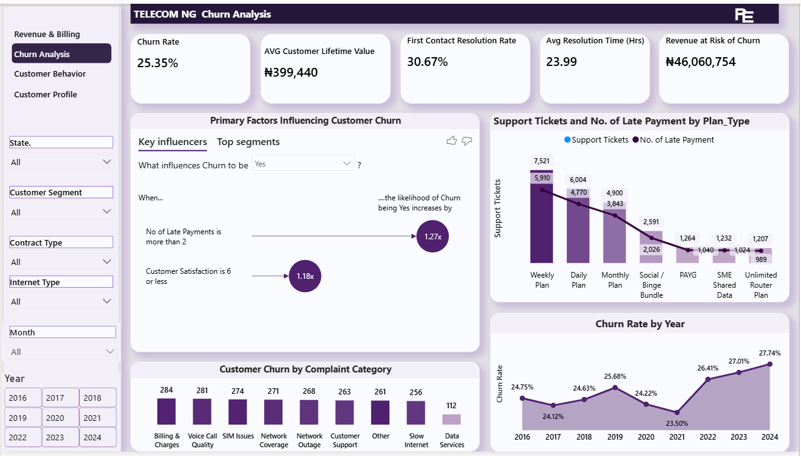
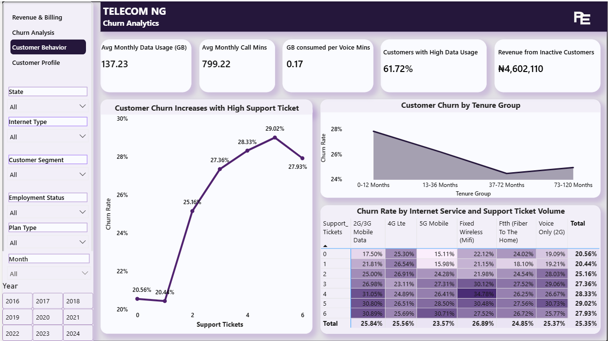
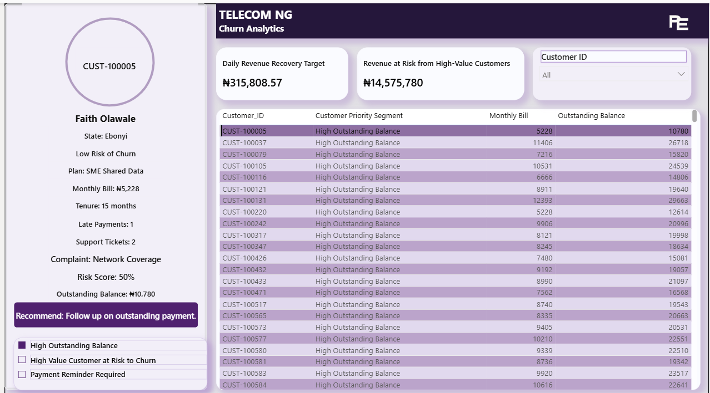

# telecom-ng-customer-churn-analytics
Power BI customer churn analytics project featuring predictive modelling with Logistic Regression, custom DAX measures, and an interactive dashboard for revenue, billing, and customer retention analysis.

# Project Overview

Customer churn is one of the biggest challenges facing telecommunication companies. Losing existing customers reduces revenue, increases acquisition costs, and affects long-term profitability.

This project analyzes customer churn using a telecom dataset to identify the behaviours, payment patterns, and service-related factors associated with customer attrition. It combines business analysis, predictive modelling, and interactive reporting to answer an important business question:

Which customers are most likely to churn, and what actions can be taken before they leave?

The project includes a Logistic Regression model to estimate churn probability, busines focused DAX measures, and an interactive Power BI dashboard that supports both executive reporting and customer-level analysis.

The dashboard allows users to monitor revenue, billing performance, customer behaviour, churn trends, and individual customer profiles from a single report.

# Business Problem

Telecommunication companies generate large amounts of customer data every day, but turning that data into meaningful business decisions remains a challenge.

# This project was developed to help answer questions such as:

- Which customers are most likely to churn?
- Which customer segments contribute the most revenue?
- How much revenue is currently at risk?
- What factors have the strongest influence on customer churn?
- How do payment behaviour, complaints, support tickets, and service usage affect churn?
- Which customers should be prioritized for retention?
- What actions should be taken for different customer groups?

The goal was to bring these insights together in a single dashboard that supports customer retention, revenue monitoring, and operational decision making.

# Project Objectives

The objectives of this project were to:

- Analyze customer behaviour and identify patterns associated with churn.
- Predict the likelihood of customer churn using a Logistic Regression model.
- Monitor revenue, outstanding balances, and collection performance.
- Explore the relationship between customer demographics, service usage, billing, complaints, and support interactions.
- Segment customers based on business priority.
- Build an interactive dashboard for monitoring business performance and exploring individual customer profiles.

# Predictive Modelling

A Logistic Regression model was used to estimate the likelihood of customer churn and support the dashboard's customer risk analysis.

The target variable was Churn, where customers who churned were encoded as 1 and customers who remained were encoded as 0.

# The model was trained using the following customer attributes:

- Age
- Monthly Income
- Monthly Data Usage (GB)
- Monthly Bill
- Risk Score
- Customer Satisfaction
- Net Promoter Score (NPS)
- Mobile App Login (Last 30 Days)
- Tenure (Months)

Before training, the predictor variables were standardized using StandardScaler to ensure they were measured on a comparable scale. The dataset was then divided into 80% training data and 20% testing data.

To improve performance on an imbalanced target, the Logistic Regression model was trained using balanced class weights. Model performance was evaluated using accuracy, a confusion matrix, and a classification report.

The resulting churn predictions were incorporated into the final analysis and used to support customer risk assessment within the Power BI dashboard.

# Dashboard Overview

The Power BI dashboard is organized into four report pages. Each page focuses on a different aspect of customer performance, allowing users to move from overall business performance to individual customer analysis.

# 1. Revenue and Billing

The Revenue and Billing page provides an overview of the company's revenue, customer distribution, and billing performance.

# Key business questions answered include:

- How many active customers does the company currently have?
- How much monthly revenue is being generated?
- How much revenue has been lost due to customer churn?
- What percentage of billable revenue has been collected?
- Which states have the highest outstanding balances?
- Which subscription plans generate the most revenue?
- How are customers distributed across different plan types?

This page provides a quick summary of business performance and highlights areas that require immediate attention.

# 2. Customer Churn Analysis

The Customer Churn Analysis page focuses on identifying the factors associated with customer churn and understanding the characteristics of customers who are most likely to leave.

# Key business questions answered include:

- Which factors have the strongest influence on churn?
- Which complaint categories are most common?
- How has churn changed over time?
- How does customer satisfaction relate to churn?
- Which customer segments experience the highest churn?
- How do support interactions influence customer retention?

This page helps identify patterns that can support customer retention strategies.

# 3. Customer Behaviour

The Customer Behaviour page explores customer engagement, service usage, and payment behaviour to provide additional insight into how customers interact with telecom services.

# Key business questions answered include:

- How does customer tenure vary across different segments?
- How are customers distributed by age and income?
- Which internet and contract types are most common?
- How do payment methods and payment status vary across customers?
- How engaged are customers based on mobile app usage and digital interactions?

This page provides additional context that complements the churn analysis.

# 4. Customer Profile

The Customer Profile page allows users to examine an individual customer in detail.

# After selecting a customer, the dashboard displays:

- Customer ID
- Customer Name
- State
- Customer Priority Segment
- Monthly Bill
- Outstanding Balance
- Plan Type
- Tenure
- Risk Score
- Support Tickets
- Complaint Category
- Recommended Action

The page also includes customer specific business metrics that help users understand the customer's value, billing status, and overall risk.

Instead of searching through a table, users can select a customer and view all relevant information in one place, making it easier to review customer history and determine the appropriate follow up action.

# Custom DAX Measures

The dashboard uses custom DAX measures to calculate key business metrics, including revenue, outstanding balances, collection efficiency, churn risk, customer prioritization, and recommended actions. A complete list of measures and their formulas is available in the DAX Measures documentation included in this repository.

# Key Insights

The analysis revealed several important findings across revenue, customer churn, billing, and customer behaviour:

- The business generated ₦27.04 million in monthly revenue, while ₦7.17 million was associated with customers who had already churned. This highlights the financial impact of customer attrition on monthly revenue.
- ₦1.88 million in monthly revenue was linked to customers identified as having a high risk of churn, showing that a relatively small group of customers represents a significant revenue retention opportunity.
- The dashboard recorded a Collection Efficiency of 83.9%, indicating that most billed revenue was successfully collected while highlighting opportunities to improve payment recovery.
- Federal Capital Territory (Abuja), Delta, Edo, and Akwa Ibom recorded the highest outstanding balances, suggesting these locations may require additional focus for billing recovery and collection efforts.
- Premium Plus generated the highest monthly revenue among all subscription plans, demonstrating its importance to overall business revenue.
- Customer complaints, support tickets, customer satisfaction, and churn risk showed clear relationships, suggesting that service quality and customer experience play an important role in customer retention.
- The Logistic Regression model, combined with business rules and customer segmentation, helped identify customers who require immediate attention before they churn, allowing retention efforts to be prioritized more effectively.
- Bringing customer information, billing history, churn probability, and recommended actions together in a single Customer Profile page makes it easier to review individual accounts and support faster operational decisions.

Thank you for taking the time to explore this project. Feedback and suggestions are always welcome.

You can connect with me on LinkedIn or reach me via email.

- LinkedIn: https://linkedin.com/in/ekete-peace-a7837b275
- Email: peaceekete8e@gmail.com
